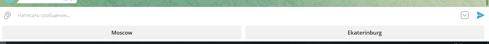

# parcer_magnit_promo
Парсинг акций с сайта магазина ООО "Магнит", и дальнейшая загрузка файла, через телеграм бота

# Подготовка:
В проекте используется Python v3.8

1)  В файле requirements.txt, указан список использующихся библиотек. Его можно установить по команде в терминале: `pip install -r requirements.txt`

2) Запуск файла по команде в терминале `python app.py`

# Работа

После запуска бота, необходимо прописать команду в чате `/start`, чтобы появились кнопки по выбору города

После использования кнопок, будет произведена загрузка файла в формате xslx в телеграм канал, который можно загрузить.
